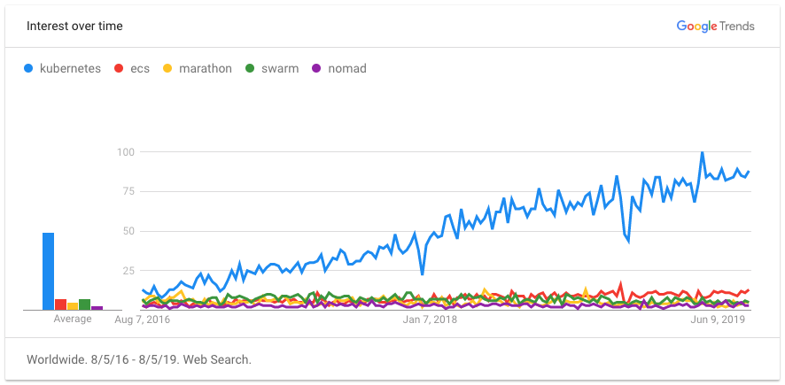
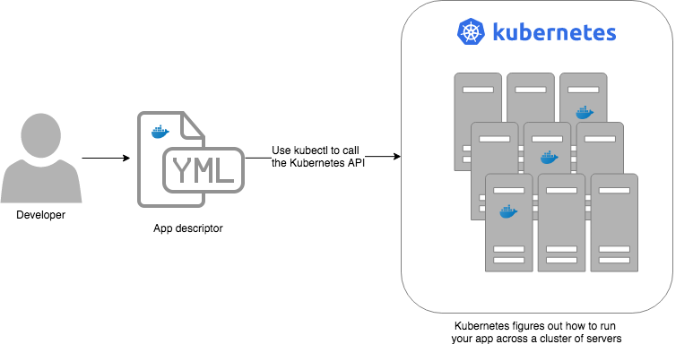
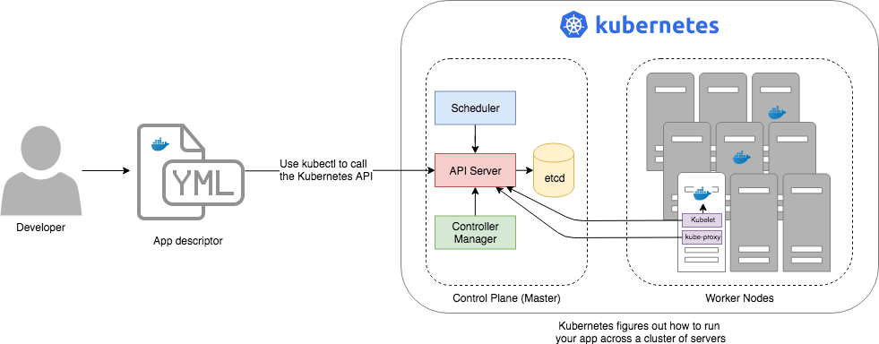
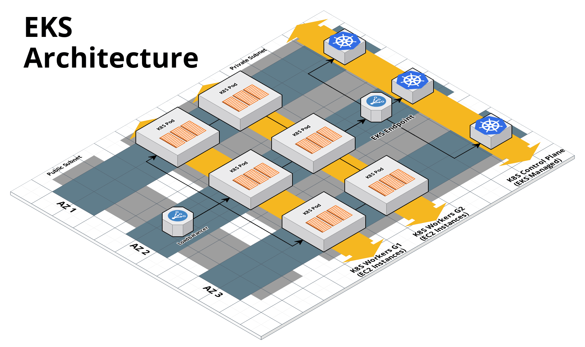
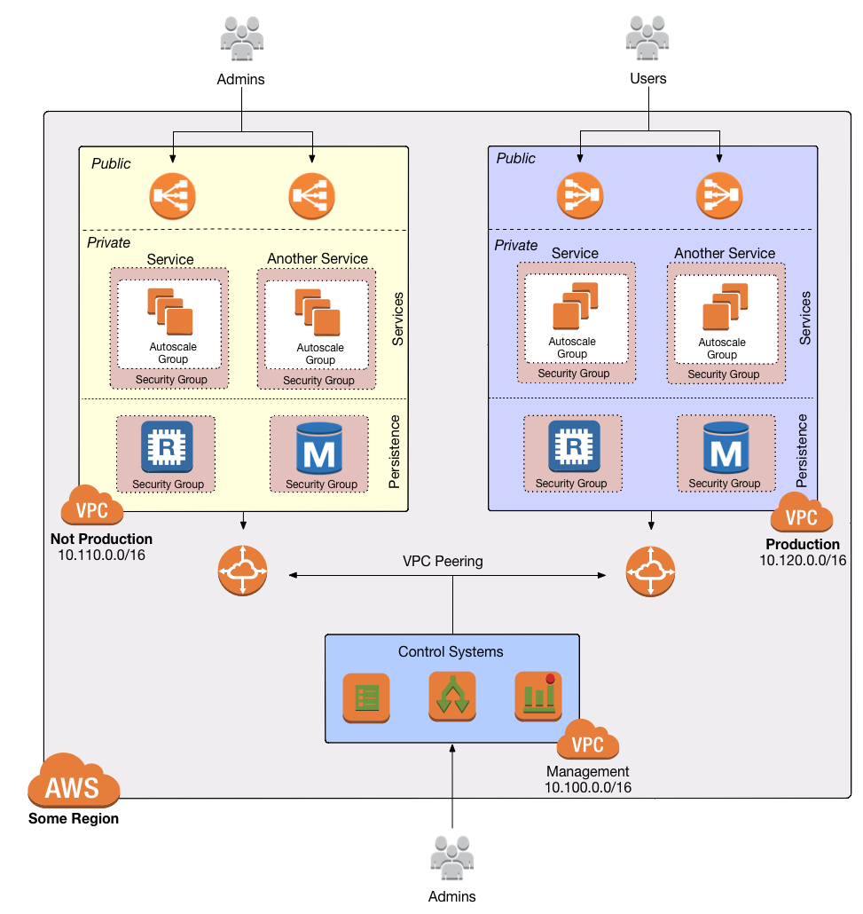

[[how_to_deploy_prod_grade_kubernetes_cluster_aws]]
= How to deploy a production-grade Kubernetes cluster on AWS
:type: guide
:description: Learn about EKS, the Kubernetes control plane, worker nodes, auto scaling, auto healing, TLS certs, VPC tagging, DNS forwarding, RBAC, and more.
:image: ../assets/img/guides/eks/amazon-eks-logo.png
:tags: aws, kubernetes, eks
:toc:
:toc-placement!:

// GitHub specific settings. See https://gist.github.com/dcode/0cfbf2699a1fe9b46ff04c41721dda74 for details.
ifdef::env-github[]
:tip-caption: :bulb:
:note-caption: :information_source:
:important-caption: :heavy_exclamation_mark:
:caution-caption: :fire:
:warning-caption: :warning:
endif::[]

toc::[]

== Intro

This guide will walk you through the process of configuring a production-grade Kubernetes cluster on AWS.

=== What is Kubernetes?

https://kubernetes.io/[Kubernetes (K8S)] is an open-source system for managing containerized applications, including:

Scheduling::
  Deploy containers across a cluster of servers, using the available resources (data centers, servers, CPU, memory,
  ports, etc.) as efficiently as possible.

Deployments::
  Roll out updates to containers using a variety of deployment strategies, such as rolling deployment, blue-green
  deployment, and canary deployment, and automatically roll back if there's an error.

Auto healing::
  Monitor the health of your containers and servers and automatically replace unhealthy ones.

Auto scaling::
  Scale the number of containers and servers up or down in response to load.

Load balancing::
  Make your containers accessible to the outside world and distribute traffic across your containers.

Service discovery::
  Allow containers to find and communicate with each other over the network, automatically routing requests to the
  proper destination.

Configuration and secrets::
  Provide containers with environment-specific configuration data and secrets.

=== What you'll learn in this guide

This guide consists of four main sections:

<<core_concepts>>::
  An overview of the core concepts you need to understand to use Kubernetes, including why you may want to use
  Kubernetes, Kubernetes architecture, the control plane, worker nodes, different ways to run Kubernetes, services,
  deployments, auto scaling, auto healing, RBAC, and more.

<<production_grade_design>>::
  An overview of how to configure a secure, scalable, highly available Kubernetes cluster that you can rely on in
  production. To get a sense of what production-grade means, check out <<production_grade_infra_checklist>>.

<<deployment_walkthrough>>::
  A step-by-step guide to deploying a production-grade Kubernetes cluster in AWS using code from the Gruntwork Service
  Catalog.

<<next_steps>>::
  What to do once you've got your Kubernetes cluster deployed.

Feel free to read the guide from start to finish or skip around to whatever part interests you!

[[core_concepts]]
== Core concepts

// TODO: ideas to discuss in the future
// - Istio
// - Helm

=== Why Kubernetes

.The popularity of container orchestration tools

Kubernetes has become the de facto choice for container orchestration. Here's why:

Massive feature set::
  Kubernetes offers a huge range of functionality for managing containers, including auto scaling, auto healing,
  rolling deployments, service discovery, secrets management, configuration management, bin packing, storage
  orchestration, batch execution, access controls, log aggregation, SSH access, batch processing, and much more.

Massive community::
  Kubernetes has the biggest community of any orchestration tool, with more than 50,000 stars and 2,500 contributors on
  https://github.com/kubernetes/kubernetes[GitHub], thousands of blog posts, numerous books, hundreds of meetup groups,
  several dedicated conferences, and a huge ecosystem of frameworks, tools, plugins, integrations, and service
  providers.

Run anywhere::
  You can run Kubernetes on-premise, in the cloud (with 1st class support from the cloud provider, e.g.,: AWS offers
  EKS, Google Cloud offers GKE, Azure offers AKS), and on your own computer (it's built directly into the Docker
  desktop app). This reduces lock-in and makes multi-cloud and hybrid-cloud more manageable, as both the containers
  themselves and the way you manage them are portable.

Proven technology::
  Kubernetes was originally designed by Google, based on years of experience with their internal container management
  systems (Borg and Omega), and is now maintained by the Cloud Native Computing Foundation. It's designed for massive
  scale and resiliency (Google runs billions of containers per week) and with a huge community behind it, it's
  continuously getting better.

=== Kubernetes architecture

Let's start by looking at Kubernetes from a very high level, and then gradually zoom in. When starting at this high
level, a simple way to think about Kubernetes is as an operating system for your data center.

.Kubernetes is like an operating system for your data center, abstracting away the underlying hardware behind its API

Operating system for a single computer::
  On a single computer, the operating system (e.g., Windows, Linux, macOS) abstracts away all the low-level hardware
  details so that as a developer, you can build apps against a high-level, consistent, safe API (the _Kernel API_),
  without having to worry too much about the differences between many types of hardware (i.e., the many types of CPU,
  RAM, hard drive, etc) or about managing any of the applications running on that hardware (i.e., the OS handles device
  drivers, time sharing, memory management, process isolation, etc).

Operating system for a data center::
  In a data center, an orchestration tool like Kubernetes also abstracts away all the hardware details, but it does it
  for multiple computers (multiple servers), so that as a developer, you can deploy your applications using a
  high-level, consistent, safe API (the _Kubernetes API_), without having to worry too much about the differences
  between the servers or about managing any of the applications running on those servers.

To use the Kernel API, your application makes system calls. To use the Kubernetes API, you make HTTPS calls, typically
by using the official command-line utility for Kubernetes,
https://kubernetes.io/docs/reference/kubectl/overview/[kubectl]. When working with the Kubernetes API, you express
_what_ you want to deploy—i.e., which Docker containers, how many of them, what CPU, memory, and ports they need,
etc—in a YAML file, use `kubectl` to make send that YAML file to Kubernetes via an API call, and Kubernetes will
figure out _how_ to make that happen, including picking the best servers to handle the requirements in your YAML file,
deploying the containers on those servers, monitoring and restarting the containers if they crash, scaling the number
of containers up and down with load, and so on.

If you zoom in a bit further on the Kubernetes architecture, it looks something like this:

.Kubernetes architecture

Kubernetes consists of two main pieces: the control plane and worker nodes. Each of these will be discussed next.

=== Control plane

The _https://kubernetes.io/docs/concepts/#kubernetes-control-plane[control plane]_ is responsible for managing the
entire cluster. It consists of one or more master nodes (typically 3 master nodes for high availability), where each
master node runs several components:

Kubernetes API Server::
  The _https://kubernetes.io/docs/reference/command-line-tools-reference/kube-apiserver/[Kubernetes API Server]_ is the
  endpoint you're talking to when use the Kubernetes API (e.g., via `kubectl`).

Scheduler::
  The _https://kubernetes.io/docs/reference/command-line-tools-reference/kube-scheduler/[scheduler]_ is responsible for
  figuring out which of the worker nodes to use to run your container(s). It tries to pick the "best" worker node based
  on a number of factors, such as high availability (try to run copies of the same container on different nodes so a
  failure in one node doesn't take them all down), resource utilization (try to run the container on the least utilized
  node), container requirements (try to find nodes that meet the container's requirements in terms of CPU, memory, port
  numbers, etc), and so on.

Controller Manager::
  The _https://kubernetes.io/docs/reference/command-line-tools-reference/kube-controller-manager/[controller manager]_
  runs all the _controllers_, each of which is a control loop that continuously watches the state of the cluster and
  makes changes to move the cluster towards the desired state (you define the desired state via API calls). For
  example, the _node controller_ watches worker nodes and tries to ensure the requested number of Nodes are always
  running and the _replication controller_ watches containers and tries to ensure the requested number of containers is
  always running.

etcd::
  _https://etcd.io[etcd]_ is a distributed key-value store that the master nodes use as a persistent way to store the
  cluster configuration.

=== Worker nodes

The _https://kubernetes.io/docs/concepts/architecture/nodes/[worker nodes]_ (or just _nodes_, for short) are the
servers that run your containers. Each worker node runs several components:

Kubelet::
  The _https://kubernetes.io/docs/reference/command-line-tools-reference/kubelet/[kubelet]_ is the primary agent that
  you run on each worker node. It is responsible for talking to the Kubernetes API Server, figuring out the containers
  that are supposed to be on its worker node, and deploying those containers, monitoring them, and restarting any
  containers that are unhealthy.

kube-proxy::
  The _https://kubernetes.io/docs/reference/command-line-tools-reference/kube-proxy/[Kubernetes Service Proxy (kube-proxy)]_
  also runs on each worker node. It is responsible for talking to the Kubernetes API Server, figuring out which
  containers live at which IPs, and proxying requests from containers on the same worker node to those IPs. This is
  used for Service Discovery within Kubernetes, a topic we'll discuss later.

=== Pods

With Kubernetes, you don't run containers directly. Instead, the basic building block in Kubernetes is a
_https://kubernetes.io/docs/concepts/workloads/pods/pod/[pod]_, which is a group of one or more related containers that
are always deployed together. For example, you could have a pod with just a single container, such as a container that
runs a Node.js app, or a pod with several related containers, such as one container that runs a Node.js app, another
container that runs a logs and metrics agent for the Node.js app, and a third container that runs nginx as a reverse
proxy for the Node.js app.

Whenever you tell Kubernetes to deploy a pod (e.g., using `kubectl`, which we'll discuss below), the scheduler will
pick a worker node for that pod, and the kubelet on that worker node will deploy all the containers for that pod,
running them all in the same Linux namespace. From the outside, each pod is like a logical machine, with its own IP
address and processes that are separate from all other pods.

=== Controllers

Pods are the basic building blocks of Kubernetes, but you typically don't deploy them directly either. A single pod on
a single worker node is a single point of failure: the kubelet on that node can restart the pod if it crashes, but
if the entire node crashes, or if you want to run multiple pods for high availability and scalability, you need a
higher level construct. This is where controllers come in. Controllers allow you to manage multiple pods across
multiple nodes.

Two of the most common types of controllers you're likely to use are:

https://kubernetes.io/docs/concepts/workloads/controllers/replicaset/[ReplicaSet]::
  Allows you to specify the template for a pod to deploy, plus how may _replicas_ (copies) of that pod you want, and
  constantly monitors the worker nodes to ensure exactly that many replicas are running at all times. For example, you
  could use a ReplicaSet to deploy 3 replicas of your Node.js pod, and if any of the replicas crashes, the ReplicaSet
  will automatically spin up a replacement (potentially on a different worker node).

https://kubernetes.io/docs/concepts/workloads/controllers/deployment/[Deployment]::
  Allows you to declaratively specify how to roll out updates to a ReplicaSet. For example, you could specify that you
  want to do a rolling deployment or canary deployment for your Node.js pods, and each time you change something in
  your pod template (e.g., you specify a new Docker image tag), the Deployment will automatically roll that change out
  across your replicas.

=== kubectl

https://kubernetes.io/docs/reference/kubectl/overview/[kubectl] is the official command-line interface (CLI) for
working with Kubernetes. For example, to deploy the https://hub.docker.com/r/training/webapp[training/webapp] Docker
container (a simple "Hello, World" webapp) and have it listen on port 5000, you could run:

----
$ kubectl run webapp \
    --image=training/webapp:latest \
    --port 5000 \
    --generator=run-pod/v1
----

And to see the pods running in your cluster, you could run:

----
$ kubectl get pods
NAME     READY   STATUS    RESTARTS   AGE
webapp   1/1     Running   0          71s
----

Under the hood, every CLI command you run with `kubectl` translates into a call to the Kubernetes API Server.

=== Web UI (Dashboard)

.The Kubernetes Dashboard
image::../assets/img/guides/eks/kubernetes-dashboard.png[]

The _https://kubernetes.io/docs/tasks/access-application-cluster/web-ui-dashboard/[Kubernetes Dashboard]_ is a
web-based interface you can use to manage your Kubernetes cluster. The dashboard is not enabled by default in most
Kubernetes distributions. Check out the
https://kubernetes.io/docs/tasks/access-application-cluster/web-ui-dashboard/#deploying-the-dashboard-ui[Deploying the Dashboard UI]
for instructions on deploying it and
https://kubernetes.io/docs/tasks/access-application-cluster/web-ui-dashboard/#accessing-the-dashboard-ui[Accessing the Dashboard UI]
for instructions on accessing it.

=== Namespaces

_https://kubernetes.io/docs/concepts/overview/working-with-objects/namespaces/[Namespaces]_ allow you to logically
partition your Kubernetes cluster into multiple virtual clusters. Every command you issue to the Kubernetes API Server
(e.g., via `kubectl`) runs within a namespace; if you don't specify a namespace, the `default` namespace is used. By
granting users access only to specific namespaces and by configuring the networking in your cluster to only allow
connectivity between resources in the same namespace, you can use namespaces as a lightweight way to group applications
and provide some isolation between them.

=== Services and Service Discovery

Every pod in Kubernetes gets an IP address, but this IP could change every time the pod is redeployed. Moreover, you
typically don't want the IP of a single pod, but some way to talk to all the related pods that make up a logical
service: e.g., if you have 3 replicas of your Node.js pod, what you really you want is some way to have requests
load balanced across all of these pods, even as the IPs of the individual pods or the number of pods changes.

To do this, you can create a Kubernetes _https://kubernetes.io/docs/concepts/services-networking/service/[service]_,
which can provide a single endpoint in front of a set of pods, and automatically load balance and route traffic to the
right destinations, even as the underlying pods change and move around. Your apps can then discover other services
(_service discovery_) by getting the endpoint IP from an environment variable and/or via DNS (the latter is typically
provided by a Kubernetes cluster add-on). For example, if your Node.js pods need to talk to some pods running a Java
backend, you could configure a service called `backend` in front of the Java pods, and the Node.js apps will be able to
talk to the backend by sending requests to `backend.<NAMESPACE>.svc.cluster.local`, where `<NAMESPACE>` is the name of
your Kubernetes namespace.

=== LoadBalancer and ingress

Depending on the networking plugin you use with Kubernetes, your pods are most likely accessible to other pods within
the Kubernetes cluster, but they are not accessible to the outside world. If you need to expose your pods to the public
Internet (e.g., for a user-facing service), the two most common ways to do it in Kubernetes are:

LoadBalancer::
  When defining a service in Kubernetes, you can set the type to
  _https://kubernetes.io/docs/concepts/services-networking/#loadbalancer[LoadBalancer]_, and Kubernetes will spin up
  a load balancer that listens on a specified port and distributes all traffic on that port across your pods.
+
[source,yaml]
----
apiVersion: v1
kind: Service
metadata:
  name: example
spec:
  # Route all traffic on port 80 to port 8080 of the example app
  type: LoadBalancer
  ports:
  - port: 80
    targetPort: 8080
  selector:
    app: example
----
+
Under the hood, this is implemented using different add-ons in different types of Kubernetes clusters: e.g., GKE uses a
https://cloud.google.com/load-balancing/docs/network/[GCP Network Load Balancer], whereas EKS can use either a
https://docs.aws.amazon.com/elasticloadbalancing/latest/classic/introduction.html[Classic Load Balancer] or
https://docs.aws.amazon.com/elasticloadbalancing/latest/network/introduction.html[Network Load Balancer] (see
https://docs.aws.amazon.com/eks/latest/userguide/load-balancing.html[EKS Load Balancing] for details). The advantage
of using a LoadBalancer is that it works with all traffic, regardless of protocol (e.g., HTTP, TCP, UDP, etc); the
disadvantage is that it offers no other configuration (e.g., no filtering or routing) and spins up a separate load
balancer with a separate IP or domain name for every service (which can be pricey and harder to manage).

Ingress controller::
  Another way to expose your pods is to create a standalone resource called an
  _https://kubernetes.io/docs/concepts/services-networking/ingress[ingress controller]_:
+
[source,yaml]
----
apiVersion: networking.k8s.io/v1beta1
kind: Ingress
metadata:
  name: example
spec:
  rules:
  - http:
      paths:
      # Route the /example URL to the example service on port 80
      - path: /example
        backend:
          serviceName: example
          servicePort: 80
----
+
Under the hood, ingress controllers are also implemented using different add-ons in different types of Kubernetes
clusters: for example, in GCP, the ingress controller in GKE uses the
https://cloud.google.com/load-balancing/docs/https/[Cloud Load Balancer], whereas in AWS, you can use
https://github.com/kubernetes-sigs/aws-alb-ingress-controller[aws-alb-ingress-controller] to spin up an
https://docs.aws.amazon.com/elasticloadbalancing/latest/application/introduction.html[Application Load Balancer (ALB)].
The advantage of an ingress controller is that you can share one load balancer across many services and take advantage
of higher-level features, such as path-based routing and SSL termination.

=== Configuration and secrets

To allow you to use the same container in different environments with different settings (e.g., dev, stage, prod), you
can use a _https://kubernetes.io/docs/tasks/configure-pod-container/configure-pod-configmap/[ConfigMap]_, which is a
map of key/value pairs where the values can be strings or even entire files.  Kubernetes stores ConfigMaps in etcd and
can expose specific key/value pairs or the contents of the entire ConfigMap to your containers as either environment
variables or files.

If you need to pass sensitive information to your containers (e.g., credentials or API keys), you can instead use a
_https://kubernetes.io/docs/concepts/configuration/secret/[Kubernetes Secret]_. Secrets work more or less the same
way as ConfigMaps—i.e., they contain key/value pairs and can be exposed to containers as environment variables or
files—with the main difference being that (a) Kubernetes stores Secrets in an encrypted form in etcd and (b) Kubernetes
ensures the secret is only ever stored in memory (and never the hard disk) when exposing it to your containers.

=== Kubernetes authentication

Kubernetes uses authentication plugins to authenticate API requests. Depending on the plugins you're using, there are
a number of supported
_https://kubernetes.io/docs/reference/access-authn-authz/authentication/#authentication-strategies[authentication strategies]_,
including X509 client certs, static token files, bootstrap tokens, static password files, service account tokens,
OpenID connect tokens, and more.

When you authenticate, you authenticate as one of two types of accounts:

User accounts::
  _User accounts_ are used by humans or other services outside of the Kubernetes cluster. For example, an admin at your
  company may distribute X509 certificates to your team members, or if you're using a Kubernetes service managed by your
  cloud provider (e.g., EKS in AWS or GKE in GCP), the user accounts may be the IAM user accounts you have in that
  cloud.

Service accounts::
  _Service accounts_ are managed and used by resources within the Kubernetes cluster itself, such as your pods.
  Kubernetes creates some service accounts automatically; you can create others using the Kubernetes API. The
  credentials for service accounts are stored as secrets in Kubernetes and mounted into the pods that should have
  access to those service accounts.

=== Kubernetes authorization

Once you've authenticated and the Kubernetes API Server knows _who_ you are, depending on the plugins you're using,
it will use one of several supported
_https://kubernetes.io/docs/reference/access-authn-authz/authorization/#authorization-modules[authorization modes]_ to
determine _what_ you can do. The standard authorization mode is
_https://kubernetes.io/docs/reference/access-authn-authz/rbac/[role-based access control (RBAC)]_, where you create
roles with access to specific Kubernetes APIs (e.g., the ability to call `GET` on the secrets API in a specific
namespace), and associate those roles with the specific user and service accounts that should have those permissions.

=== kubeconfig

To be able to authenticate to different EKS clusters or as different users, you can create one or more `kubectl`
configuration files, which are typically called _kubeconfig files_ (note, the files do not actually need to be called
`kubeconfig`). In a kubeconfig file, you can define one or more _contexts_, where each context specifies a cluster to
connect to and a user to use for authentication. You can then use the `kubectl config use-context` command to quickly
switch between contexts—and therefore, different clusters and users.

=== Options for running Kubernetes in AWS

There are a number of different options for running Kubernetes in AWS:

Deploy it yourself::
  You could try to follow the https://kubernetes.io/docs/home/[Kubernetes documentation] and
  https://github.com/kelseyhightower/kubernetes-the-hard-way[Kubernetes the hard way] to create a Kubernetes cluster
  from scratch on top of EC2 instances. This gives you full control over every aspect of your Kubernetes cluster, but
  it is a considerable amount of work (3-6 months to get something production-grade, minimum) and puts the full burden
  of maintenance, scalability, high availability, disaster recovery, updates, etc on you.

Kubernetes deployment tools::
  There are a number of Kubernetes tools that can automatically spin up a cluster for you, including
  https://github.com/kubernetes/kops[kops], https://kubespray.io/[kubespray], and
  https://github.com/kubernetes/kubeadm[kubeadm]. These tools allow you to get a reasonable cluster up and running in a
  few commands, significantly reducing the amount of work compared to doing it from scratch. However, it's typically
  hard to customize and manage those clusters, as you don't have the infrastructure defined as code (note: `kops` can
  generate Terraform code, but it's probably not the way you'd write the code yourself and if you modify that code,
  it's not clear if you can still use `kops`), and most importantly, these tools put the full burden of maintenance,
  scalability, high availability, disaster recovery, updates, etc on you.

Amazon Elastic Kubernetes Service::
  https://aws.amazon.com/eks/[Amazon EKS] is a managed service in AWS for using Kubernetes. It runs the entire control
  plane for you, with first-class integration with other AWS services (e.g., VPCs, IAM, etc). That means you can get
  EKS running quickly, manage everything as code, and benefit from AWS handling all the maintenance, scalability,
  high availability, disaster recovery, and updates of the control plane for you. The main drawbacks are that EKS is
  still fairly new, so some functionality is missing or more complicated to use than it should be.

[[production_grade_design]]
== Production-grade design

With all the core concepts out of the way, let's now discuss how to configure a production-grade Kubernetes cluster
that looks something like this:

.EKS architecture

=== Use EKS

We recommend using https://aws.amazon.com/eks/[Amazon EKS] to run the Kubernetes cluster. It manages the control plane
for you, which significantly reduces your operational burden; it has good integration with other AWS services; you can
manage it entirely as code; and while EKS still has some gaps in terms of features, and is more complicated to use than
it should be, AWS seems to be investing into it heavily, so any small benefits you get from using other solutions will
most likely be eclipsed very quickly by future EKS releases.

=== VPC configuration

EKS relies on an a _https://aws.amazon.com/vpc/[Virtual Private Cloud (VPC)]_ to provide the basic network topology and
to manage communication across the nodes. We recommend that you do the following:

Set up a custom VPC::
  Follow the instructions in
  link:../networking/how-to-configure-production-grade-vpc-aws[How to deploy a production-grade VPC on AWS] to create
  a VPC for EKS that looks like this:
+
.A production-grade VPC setup

Add tags to the VPC and subnets::
  EKS also relies on special tags on the VPC and subnets to know which VPC resources to use for deploying
  infrastructure. For example, EKS needs to know to use the public subnet for the load balancers associated with a
  Service resource. See https://docs.aws.amazon.com/eks/latest/userguide/network_reqs.html[Cluster VPC Considerations]
  for more information.

Configure DNS forwarding::
  EKS supports private API endpoints so that the Kubernetes API Server can only be accessed within the VPC. The
  hostname for this internal endpoint lives in a
  https://docs.aws.amazon.com/Route53/latest/DeveloperGuide/hosted-zones-private.html[Route 53 private hosted zone],
  which works fine if you're trying to access it from within the VPC, but does not work (by default) if you try to
  access it over a VPC peering connection. For example, if you had Kubernetes in an application VPC, and DevOps tooling
  (e.g., and OpenVPN server or a Jenkins server) in a peered management VPC, by default, that management tooling would
  not be able to talk to this private endpoint. To fix this issue, configure DNS forwarding by creating a
  https://docs.aws.amazon.com/Route53/latest/DeveloperGuide/resolver-getting-started.html[Route 53 Resolver] and make
  sure that remote VPC DNS resolution is enabled on both accepter and requester side of the connection peering.

=== Control plane

To have EKS manage the control plane for you, you need to create an
_https://docs.aws.amazon.com/eks/latest/userguide/clusters.html[EKS cluster]_. When you create an EKS cluster, behind
the scenes, AWS fires up several master nodes in a highly available configuration, complete with the Kubernetes API
Server, scheduler, controller manager, and etcd. Here are the key considerations for your EKS cluster:

Kubernetes version::
  When creating your EKS cluster, you can pick which version of Kubernetes to use. For each version of Kubernetes,
  EKS may have one or more _https://docs.aws.amazon.com/eks/latest/userguide/platform-versions.html[platform versions]_
  that are compatible with it. For example, Kubernetes 1.12.6 had platform versions `eks.1` and `eks.2`. AWS
  automatically updates the control plane to use the latest platform version compatible with your chosen Kubernetes
  minor version.

Subnets::
  Your EKS cluster will run in the subnets you specify. We strongly recommend running solely in private subnets that
  are NOT directly accessible from the public Internet. See
  link:../networking/how-to-configure-production-grade-vpc-aws[How to deploy a production-grade VPC on AWS] for more
  info.

Endpoint access::
  You can configure whether the https://docs.aws.amazon.com/eks/latest/userguide/cluster-endpoint.html[API endpoint for your EKS cluster]
  is accessible from (a) within the same VPC and/or (b) from the public Internet. We recommend allowing access from
  within the VPC, but not from the public Internet. If you need to talk to your Kubernetes cluster from your own
  computer (e.g., to issue commands via `kubectl`), use a bastion host or VPN server. See
  link:../networking/how-to-configure-production-grade-vpc-aws[How to deploy a production-grade VPC on AWS] for more
  info.

Cluster IAM Role::
  To be able to make API calls to other AWS services,
  https://docs.aws.amazon.com/eks/latest/userguide/service_IAM_role.html[your EKS cluster must have an IAM role] with
  the following managed IAM policies: `AmazonEKSServicePolicy` and `AmazonEKSClusterPolicy`.

Security group::
  You should define a security group that controls what traffic can go in and out of the control plane. The worker
  nodes must be able to talk to the control plane and vice versa: see
  https://docs.aws.amazon.com/eks/latest/userguide/sec-group-reqs.html[Cluster Security Group Considerations] for the
  ports you should open up between them.

Logging::
  We recommend enabling https://docs.aws.amazon.com/eks/latest/userguide/control-plane-logs.html[control plane logging]
  so that the logs from the Kubernetes API server, controller manager, scheduler, and other components are sent to
  CloudWatch.

=== Worker nodes

While EKS will run the control plane for you, it's up to you to create the worker nodes. Here are the key
considerations:

Auto Scaling Group::
  We recommend using an https://docs.aws.amazon.com/autoscaling/ec2/userguide/AutoScalingGroup.html[Auto Scaling Group]
  to run your worker nodes. This way, failed nodes will be automatically replaced, and you can use auto scaling
  policies to automatically scale the number of nodes up and down in response to load.

Tags::
  EKS requires that all worker node EC2 instances have a tag with the key `kubernetes.io/cluster/<CLUSTER_NAME>` and
  value `owned`.

Subnets::
  We strongly recommend running the Auto Scaling Group for your worker nodes in private subnets that are NOT directly
  accessible from the public Internet. See
  link:../networking/how-to-configure-production-grade-vpc-aws[How to deploy a production-grade VPC on AWS] for more
  info.

AMI::
  Each worker node will need Docker, kubelet,
  https://github.com/kubernetes-sigs/aws-iam-authenticator[AWS IAM Authenticator], and a
  https://docs.aws.amazon.com/eks/latest/userguide/launch-workers.html[bootstrap script] installed. We recommend
  using the
  https://docs.aws.amazon.com/eks/latest/userguide/eks-optimized-ami.html[Amazon EKS-Optimized AMI] or one of the
  https://docs.aws.amazon.com/eks/latest/userguide/eks-partner-amis.html[EKS partner AMIs] (e.g., there is an Ubuntu
  AMI), as these already have all the necessary software installed.

User Data::
  Each worker node must register itself to the Kubernetes API. This can be done using a
  https://docs.aws.amazon.com/eks/latest/userguide/launch-workers.html[bootstrap script] that is bundled with the EKS
  optimized AMI. We recommend running this bootstrap script as part of
  https://docs.aws.amazon.com/AWSEC2/latest/UserGuide/user-data.html[User Data] so that it executes when the EC2
  instance is booting.

IAM role::
  In order for the kubelet on each worker node to be able to make API calls, each
  https://docs.aws.amazon.com/eks/latest/userguide/worker_node_IAM_role.html[worker node must have an IAM role] with
  the following managed IAM policies: `AmazonEKSWorkerNodePolicy`, `AmazonEKS_CNI_Policy`,
  `AmazonEC2ContainerRegistryReadOnly`.

Security group::
  You should define a security group that controls what traffic can go in and out of each worker node. The worker
  nodes must be able to talk to the control plane and vice versa: see
  https://docs.aws.amazon.com/eks/latest/userguide/sec-group-reqs.html[Cluster Security Group Considerations] for the
  ports you should open up between them.

Server hardening::
  There are a number of server-hardening best techniques that you should apply to each worker node. This includes
  a secure base image (e.g., CIS hardened images), intrusion prevention (e.g., `fail2ban`), file integrity monitoring
  (e.g., Tripwire), anti-virus (e.g., Sophos), automatically installing critical security updates (e.g.,
  `unattended-upgrades` for Ubuntu), locking down EC2 metadata (e.g., `ip-lockdown`), and so on.

=== Authenticate

The standard way to interact with a Kubernetes cluster is to use `kubectl`. However, in order to use `kubectl` to
access your EKS cluster, you need to first authenticate it to the cluster. EKS manages authentication to Kubernetes
based on AWS IAM, which is not natively supported by `kubectl`. Therefore, before using `kubectl`, you have to use one
of the following utilities to authenticate:

https://aws.amazon.com/cli/[AWS CLI]::
  AWS now has first-class support for authenticating to EKS built directly into the `aws` CLI (minimum version:
  `1.16.232`). See https://docs.aws.amazon.com/cli/latest/userguide/cli-chap-install.html[Installing the AWS CLI] for
  setup instructions. To use it, you fist run the `update-kubeconfig` command:
+
----
aws eks update-kubeconfig --region <AWS_REGION> --name <EKS_CLUSTER_NAME>
----
+
This will update your kubeconfig so that `kubectl` will automatically call `aws eks get-token` for authentication; the
`aws eks get-token` command will, in turn, use the standard
https://blog.gruntwork.io/a-comprehensive-guide-to-authenticating-to-aws-on-the-command-line-63656a686799[AWS CLI mechanisms to authenticate to AWS]:
i.e., the credentials file at `~/.aws/credentials`, environment variables, etc. That means that can now start running
your standard `kubectl` commands:
+
----
kubectl get nodes
----

https://github.com/gruntwork-io/kubergrunt[kubergrunt]::
  A CLI tool maintained by Gruntwork that supports authentication to EKS, as well as several other important utilities,
  such as tools for managing TLS certificates in Kubernetes. The easiest way to install it is to
  use one of the pre-built binaries from the
  https://github.com/gruntwork-io/kubergrunt/releases[kubergrunt releases] page. The usage is very similar to the AWS
  CLI. You first run `kubergrunt eks configure`:
+
----
kubergrunt eks configure --eks-cluster-arn <EKS_CLUSTER_ARN>
----
+
This will update your kubeconfig to use `kubergrunt eks token` for authentication, which means you can now start
running your normal `kubectl` commands:
+
----
kubectl get nodes
----

https://github.com/kubernetes-sigs/aws-iam-authenticator[AWS IAM Authenticator for Kubernetes]::
  A CLI tool maintained by the Heptio and Amazon EKS teams. This was the main tool AWS recommended for authenticating
  to EKS until first-class support was added directly to the AWS CLI. At this point, there is no reason to install
  this tool separately, so we are just recording this here for historical reasons.

=== IAM role mapping and RBAC

You've seen that to determine _who_ the user is (authentication), EKS uses IAM. The next step is to determine _what_
the user can do (authorization). Kubernetes uses its own roles and RBAC for authorization, so the question is, how does
EKS know which IAM entities (that is, IAM users or roles) are associated with which Kubernetes roles?

The answer is that EKS expects you to define a ConfigMap called `aws-auth` that defines the mapping from IAM entities
to Kubernetes roles. When you first provision an EKS cluster, the IAM user or role that you used to authenticate is
automatically granted admin level permissions (the `system:master` role). You can use this role to add additional role
mappings in the `aws-auth` ConfigMap.

Here's an example `aws-auth` ConfigMap:

[source,yaml]
----
apiVersion: v1
kind: ConfigMap
metadata:
  name: aws-auth
  namespace: kube-system
data:
  mapRoles: |
    - rolearn: arn:aws:iam::11122223333:role/example-role
      username: system:node:{{EC2PrivateDNSName}}
      groups:
        - system:bootstrappers
        - system:nodes
  mapUsers: |
    - userarn: arn:aws:iam::11122223333:user/example-user
      username: designated_user
      groups:
        - system:masters
----

This ConfigMap tells EKS that anyone who authenticates as the IAM role called `example-role` should automatically get
the permissions in the `system:bootstrappers` and `system:nodes` Kubernetes roles, and anyone who authenticates with as
the IAM user `example-user` should automatically get the permissions in the `system:masters` Kubernetes role.

Note that, as of September, 2019, the `aws-auth` ConfigMap supports mapping IAM roles and IAM users, but not IAM groups
(see https://docs.aws.amazon.com/en_pv/eks/latest/userguide/add-user-role.html[Managing Users or IAM Roles for your EKS Cluster]).
Mapping every individual user in your organization is most likely difficult to manage, so we instead recommend creating
IAM roles, mapping those IAM roles to Kubernetes roles in `aws-auth`, and allowing IAM users in specific IAM groups to
assume those roles.

=== LoadBalancer and ingress

EKS has https://docs.aws.amazon.com/eks/latest/userguide/load-balancing.html[built-in support for the LoadBalancer]
service type. It uses the Classic Load Balancer by default; if you wish to use the Network Load Balancer instead, you
need to add the following annotation to your service:

[source,yaml]
----
service.beta.kubernetes.io/aws-load-balancer-type: nlb
----

For most HTTP/HTTPS use cases, you'll instead want to use an ingress controller, to take advantage of SSL termination
and path-based routing. To support this, you will need to install and configure the
https://github.com/kubernetes-sigs/aws-alb-ingress-controller[aws-alb-ingress-controller].

=== External DNS

If you're using the ingress controller, then Kubernetes will automatically spin up an ALB for you in AWS. How, then, do
you configure DNS settings for that ALB? Normally, we recommend using Terraform to configure DNS entries (e.g., using
the https://www.terraform.io/docs/providers/aws/r/route53_record.html[aws_route53_record resource]), but what do you do
when the ALB is deployed (asynchronously) by Kubernetes?

We recommend solving this by using installing the https://github.com/kubernetes-incubator/external-dns[external-dns]
add-on, which will:

. Automatically find hostnames you've defined in your ingress configurations.
. Wait for the ingress controller to finish deploying (e.g., wait for the ALB to deploy).
. Create DNS entries for those hostnames in your chose DNS provider (e.g., in Route 53, Google Cloud DNS, CloudFlare,
  etc)

Note that external-dns will only add DNS entries to existing domains; it's up to you to register the domains (e.g.,
in Route 53, GoDaddy, etc) as you normally do.

=== Logging

We recommend enabling the following logging to help with debugging and troubleshooting:

Control plane logging::
  Enable all https://docs.aws.amazon.com/eks/latest/userguide/control-plane-logs.html[control plane logging] in EKS,
  including API server logs, audit logs, authenticator logs, controller manager logs, and scheduler logs. This will
  allow you to see all the logs in CloudWatch..

Worker node logging::
  We recommend installing https://github.com/helm/charts/tree/master/incubator/fluentd-cloudwatch[fluentd-cloudwatch]
  in the EKS cluster. This will run https://www.fluentd.org/[fluentd] on each worker node and configure it to send all
  the logs from the worker nodes (including all the pods on them) to CloudWatch.

=== Protecting pods

There are several policies you may want to enable to protect the pods in your cluster:

PodSecurityPolicy::
  You can use a _https://kubernetes.io/docs/concepts/policy/pod-security-policy/[PodSecurityPolicy]_ to define what
  security-related features users can or can’t use in their pods. For example, you can specify if pods can run
  `privileged` containers, which ports a container can bind to, which kernel capabilities can be added to a container,
  what user IDs a container can run as, and so on. Follow the
  https://en.wikipedia.org/wiki/Principle_of_least_privilege[principle of least privilege] and provide pods with as few
  permissions as possible. You can also use RBAC to assign a different PodSecurityPolicy to different users or roles
  (e.g., give admins a less restrictive PodSecurityPolicy than other users).

NetworkPolicy::
  You can use a _https://kubernetes.io/docs/concepts/services-networking/network-policies/[NetworkPolicy]_ to define
  the inbound and outbound networking rules for your pods. We recommend adding a default NetworkPolicy that denies all
  inbound and outbound traffic (again, principle of least privilege) and then adding a NetworkPolicy for each pod that
  gives it permissions to talk solely to the other pods it should be able to access.

[[deployment_walkthrough]]
== Deployment walkthrough

Let's now walk through how to deploy a production-grade Kubernetes cluster, fully defined and managed as code, using
the Gruntwork Service Catalog.

[[pre_requisites]]
=== Pre-requisites

This walkthrough has the following pre-requistes:

Gruntwork Service Catalog::
  This guide uses code from the https://gruntwork.io/infrastructure-as-code-library/[Gruntwork Service Catalog], as it
  implements most of the production-grade design for you out of the box.
+
IMPORTANT: You must be a https://gruntwork.io/[Gruntwork subscriber] to access this code.
+
Make sure to read <<how_to_use_gruntwork_service_catalog>>.

Terraform::
  This guide uses https://www.terraform.io/[Terraform] to define and manage all the infrastructure as code. If you're
  not familiar with Terraform, check out https://blog.gruntwork.io/a-comprehensive-guide-to-terraform-b3d32832baca[A
  Comprehensive Guide to Terraform], https://training.gruntwork.io/p/terraform[A Crash Course on Terraform], and
  <<how_to_use_gruntwork_service_catalog>>.

AWS accounts::
  This guide deploys infrastructure into one or more AWS accounts. Check out the
  <<production_grade_aws_account_structure>> guide for instructions. You will also need to be able to authenticate to
  these accounts on the CLI: check out
  https://blog.gruntwork.io/a-comprehensive-guide-to-authenticating-to-aws-on-the-command-line-63656a686799[A Comprehensive Guide to Authenticating to AWS on the Command Line]
  for instructions.

=== Do stuff

TODO

For more information on setting up IAM users, IAM groups, and IAM roles, see
link:../foundations/how-to-configure-production-grade-aws-account-structure[How to configure a production-grade AWS account structure].

. Install the https://github.com/kubernetes-sigs/aws-alb-ingress-controller[aws-alb-ingress-controller].
. Any services you deploy that need to work with the ingress controller will have to set their type to `NodePort`.
. Update the worker node security group to allow inbound requests from the ALB.
. Configure the ingress controller with a minimal set of
https://kubernetes-sigs.github.io/aws-alb-ingress-controller/guide/controller/config/#aws-api-access[IAM permissions].

https://github.com/gruntwork-io/terraform-aws-eks/tree/master/modules/eks-k8s-external-dns-iam-policy
https://github.com/gruntwork-io/terraform-aws-eks/tree/master/modules/eks-k8s-external-dns

https://github.com/gruntwork-io/terraform-aws-eks/tree/master/modules/eks-cluster-control-plane#control-plane-logging
https://github.com/gruntwork-io/terraform-aws-eks/tree/master/modules/eks-cloudwatch-container-logs

Rolling out updates::
Deploying the worker nodes initially is not enough; you also need a strategy for updating the worker nodes, without
downtime, when there are new versions of Kubernetes, new AMIs, and so on. AWS does not https://github.com/gruntwork-io/kubergrunt#deploy

[[next_steps]]
== Next steps

TODO
