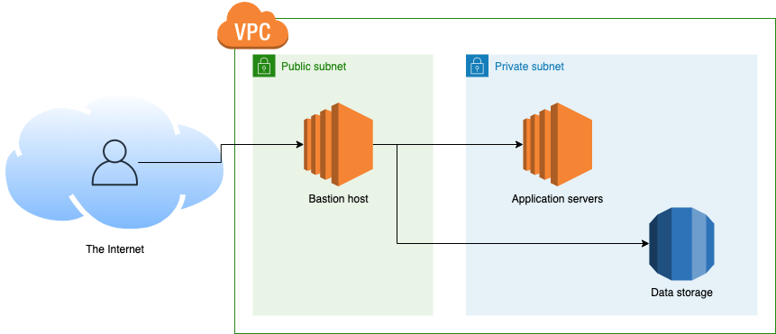

:page-type: guide
:page-layout: post

:toc:
:toc-placement!:

// GitHub specific settings. See https://gist.github.com/dcode/0cfbf2699a1fe9b46ff04c41721dda74 for details.
ifdef::env-github[]
:tip-caption: :bulb:
:note-caption: :information_source:
:important-caption: :heavy_exclamation_mark:
:caution-caption: :fire:
:warning-caption: :warning:
toc::[]
endif::[]

== Intro

If you were following the https://gruntwork.io/guides/networking/how-to-deploy-production-grade-vpc-aws[Gruntwork guide on how to deploy a production grade VPC on AWS], then you probably came across https://gruntwork.io/guides/networking/how-to-deploy-production-grade-vpc-aws/#bastion_host[the section talking about bastion hosts].

This guide will walk you through the process of configuring a production-grade bastion host on AWS.

When deploying your infrastructure in AWS or any of the other main cloud providers, we recommend keeping your data stores and application servers in a private network (see the https://gruntwork.io/guides/networking/how-to-deploy-production-grade-vpc-aws/#multiple_subnets[production-grade VPC guide]). While this might depend on your system architecture, most likely, you would want to keep them secure and only allow access from trusted sources. This means you will need some way of determining if the access and traffic to your private network is to be trusted or not. There's many ways to achieve that, and one of them is to simply restrict access to your private resources, and only allow it from the so-called "bastion server". We'll cover what this means exactly in a bit.

A bastion host sits in the public network, and is accessible directly from the Internet, or the whitelisted IP addresses in its configuration. Once connected to it, usually over SSH, the bastion host enables you to access private network resources such as EC2 and RDS instances, or any other resources also placed in the private subnet.

Typically, as a network administrator, or as a developer with the privileges to set up such servers and configure them, you would want to set up a bastion host yourself. This would allow you to examine the system logs and configure what parts of the network that server can reach, where it lives in your system, when it's online and offline, and of course who can access it.

=== What is a bastion host?

The word "bastion" was originally coined as a term in network security in 1990 by Marcus J. Ranum. Many centuries before that, the name bastion was used to describe a projecting part of a fortification, designed in such a way to offer maximum defenses from multiple angles.

In the technical world of infrastructure, a _bastion host_ is founded on this concept too - is a single, highly locked-down server that allows you to connect your private network to the public Internet over SSH or VPN.
Once connected to a bastion host, you will be "in the network", assuming the IP of that bastion host. This way you'll be able to access all resources available to that network that the bastion host is connected to. As explained in https://aws.amazon.com/blogs/security/how-to-record-ssh-sessions-established-through-a-bastion-host/[AWS's security blog], a bastion host in AWS is meant to provide access to a private subnet from an external one (e.g. one that is accessible from the Internet) and minimize the risk of penetration to the resources launched in your private subnet within your Amazon Virtual Private Cloud (VPC).

=== What you'll learn in this guide

This guide consists of four main sections:

<<core_concepts>>::
  An overview of the core concepts you need to understand for bastion hosts and how and when to use them.

<<production_grade_design>>::
  An overview of how to configure a secure server to serve as a bastion host in a production environment. To get a
  sense of what production-grade means, check out link:/guides/foundations/how-to-use-gruntwork-infrastructure-as-code-library#production_grade_infra_checklist[The production-grade infrastructure checklist].

<<deployment_walkthrough>>::
  A step-by-step guide to deploying a production-grade bastion host in AWS using code from the Gruntwork Infrastructure as Code Library.

<<next_steps>>::
  What to do once your bastion host is configured and set up.

Feel free to read the guide from start to finish or skip around to whatever part interests you!

[[core_concepts]]
== Core concepts

[[bastion_host_overview]]
=== What exactly does a bastion host do?

As we've already briefly explained, a bastion host can provide you access to resources within your private or persistent subnets. But let's take a deeper look at what exactly happens behind the scenes.

A bastion host is a essentially a server with some special settings that allows access only from specific IP addresses under certain conditions that may be location, recognised devices, or number of users using the bastion host at a time, and so on. The important detail to note here is that your network is configured also in a way, where it expects access to the private resources and data stores, only from that same bastion host. This would ensure that you only have one point of entry, which reduces the surface attack area.

In the next sections we'll cover a bit widely some of the concepts and the special settings that make up a bastion server.

=== Do you even need a bastion host?

A bastion server is considered to be one of the security best practices, especially when it comes to the cloud and AWS. It is very popular as a solution, because of the benefits it brings in comparison to the risks it helps you mitigate.

Let's consider this example:

You have a webapp that processes some personal and payment data. For your customers to be able to interact with the webapp, it will need to be hosted on a public-facing EC2 instance, or something equivalent (in case you're using containerised solutions). You might be confident with the design and configuration of your webapp server, but you may not want to allow customers to have direct access to your payment services and data stores of payment and personal data. In that case, you place your application servers (the ones responsible for your payment and personal data processing) and your data stores in a private subnet in the VPC. This means you've essentially created a "DMZ" zone, short for "demilitarized zone". A DMZ zone is the perimeter within your network you're comfortable with it being accessible to the external world. For more in-depth explanation of what a good VPC and network setup looks like for your production environments, read https://gruntwork.io/guides/networking/how-to-deploy-production-grade-vpc-aws/#multiple_subnets[our guide on the topic].

Now let's extend the example with your developers needing access to the private services (payment processing server) and maybe even data stores, ehile they're troubleshooting a live incident. How would they access your private subnet resources? You could allow permanent access for your developers to these internal systems with highly-senstive data, but this breaks one of the many security-best practices such as least privilege access by default.

This is where having a bastion host is truly useful. Having a bastion box ready to go (sometimes referred to as a "jump") box), you'll be in a position where you can enable your developers to jump on the bastion host, and from there be able to get access to the internal services and data stores only while investigating the incident. Once the incident is resolved, you could simply turn off the bastion host, and all access to it will be ceased. Which means in its turn, access to the private services with sensitive and highly confidential data is no longer accessible by the developers, or anyone else.

=== Production-grade server hardening techniques for the bastion serve
The above example assumed the bastion box is set up in a way, where it allows your developers access immediately and easily, the server itself can be turned on or off, and has access to the private resources. Let's have a look how what would the network setup look like for a bastion server, and what are the production-grade security settings for a bastion box.

=== How do you access the bastion host?

=== Are there alternatives to bastion servers?
=== What is the difference between SSH, RDP and VPN?
=== Does the bastion server need securing too?
  - They provide entry into your private subnet.
  - The bastion host will need to be exposed to the external world, so it needs a public IP address. This also means that it needs to be placed within the boundaries of the public subnet.
  - To communicate with the bastion host, users will need SSH or VPN access set up. These are the most common ways a bastion server can be set up.

[[how_bastion_with_ssh]]
=== How SSH access works with a bastion host?

[[bastion_alternatives]]
== What alternatives are there to using a bastion host?
Some of the alternatives to using a bastion host that will also work with resources in private subnets include
https://docs.aws.amazon.com/AWSEC2/latest/UserGuide/Connect-using-EC2-Instance-Connect.html[EC2 Instance Connect],
which can allow you to SSH to EC2 Instances via a browser-based SSH client in the Amazon EC2 Console, and
https://docs.aws.amazon.com/systems-manager/latest/userguide/session-manager.html[AWS Systems Manager Sessions], which
allow you to manage and connect to EC2 Instances via a custom protocol managed by AWS.

[[deployment_walkthrough]]
== Deployment walkthrough

Let's now walk through how to deploy a production-grade server that will be our bastion host, fully defined and managed as code, using the Gruntwork Infrastructure as Code Library.

//TODO add your code

[[pre_requisites]]
=== Pre-requisites

This walkthrough has the following pre-requisites:

Gruntwork Infrastructure as Code Library::
  This guide uses code from the https://gruntwork.io/infrastructure-as-code-library/[Gruntwork Infrastructure as Code Library], as it
  implements most of the production-grade design for you out of the box. Make sure to read
  link:/guides/foundations/how-to-use-gruntwork-infrastructure-as-code-library[How to use the Gruntwork Infrastructure as Code Library].
+
[.exceptional]
IMPORTANT: You must be a [js-subscribe-cta]#Gruntwork subscriber# to access the Gruntwork Infrastructure as Code Library.

Terraform::
  This guide uses https://www.terraform.io/[Terraform] to define and manage all the infrastructure as code. If you're
  not familiar with Terraform, check out https://blog.gruntwork.io/a-comprehensive-guide-to-terraform-b3d32832baca[A
  Comprehensive Guide to Terraform], https://training.gruntwork.io/p/terraform[A Crash Course on Terraform], and
  link:/guides/foundations/how-to-use-gruntwork-infrastructure-as-code-library[How to Use the Gruntwork Infrastructure as Code Library]

AWS accounts::
  This guide deploys infrastructure into one or more AWS accounts. Check out the
  link:/guides/foundations/how-to-configure-production-grade-aws-account-structure[Production Grade AWS Account Structure] guide for instructions.
  You will also need to be able to authenticate to these accounts on the CLI: check out
  https://blog.gruntwork.io/a-comprehensive-guide-to-authenticating-to-aws-on-the-command-line-63656a686799[A Comprehensive Guide to Authenticating to AWS on the Command Line]
  for instructions.

[[deploy_bastion_server]]
=== Deploy a bastion server

For this part we will be deploying one of our core module https://github.com/gruntwork-io/terraform-aws-server/blob/master/modules/single-server[`single-server module`].
